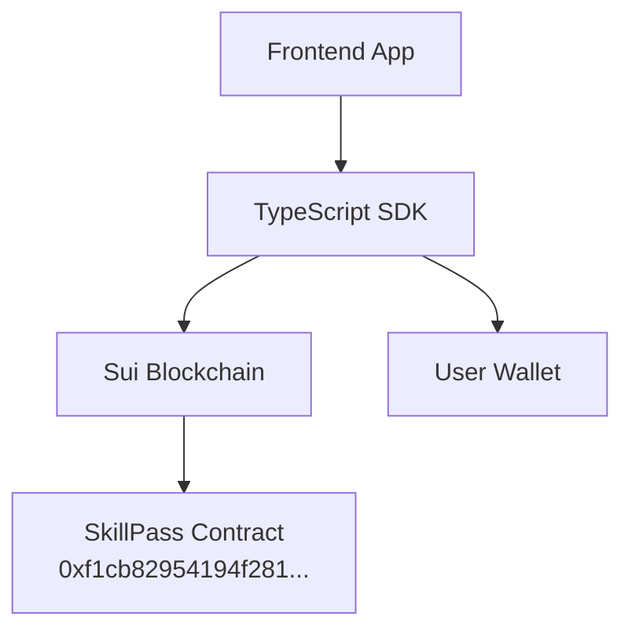

# 🚀 SkillPass Deployment & Integration Guide

## 📁 Project Structure (Cleaned)

```
skillpass/
├── sources/
│   └── skillpass.move           # 🔗 Smart contract (already deployed)
├── tests/
│   └── skillpass_tests.move     # 🧪 Move unit tests
├── scripts/
│   ├── mint_test_certificate.move
│   └── test_mint.move
├── test-certificate-minting.js  # 🧪 JavaScript test file
├── test-mint-certificate.ts     # 📦 TypeScript SDK integration
├── mint-certificate-cli.ps1     # 🖥️ PowerShell CLI tool
├── verify-certificate.ps1       # ✅ Certificate verification
├── Move.toml                     # 📋 Move project config
├── package.json                  # 📦 Node.js dependencies
├── tsconfig.json                 # ⚙️ TypeScript config
└── README.md                     # 📖 Documentation
```

## 🔄 **NO HOSTING REQUIRED** - Frontend Integration Only

### 🎯 **Integration Approach**

This is a **smart contract library**, not a standalone service. The frontend integrates directly with:

1. **Sui Blockchain** (already deployed contract)
2. **TypeScript SDK** (in this project)
3. **User's Wallet** (for transaction signing)



## 📦 **Frontend Integration Steps**

### 1. Install Dependencies
```bash
npm install @mysten/sui
```

### 2. Copy Integration Files
Copy these files to your frontend project:
- `test-mint-certificate.ts` → Rename to `skillpass-sdk.ts`
- `package.json` (dependencies section)
- `tsconfig.json` (if needed)

### 3. Import in Frontend
```typescript
import { createMintCertificateTransaction } from './skillpass-sdk';
import { SuiClient } from '@mysten/sui/client';

// Create transaction
const tx = createMintCertificateTransaction();

// Sign with wallet (Sui Wallet, Martian, etc.)
const result = await wallet.signAndExecuteTransaction({
  transaction: tx,
  chain: 'sui:testnet'
});
```

### 4. Frontend Framework Examples

#### **React/Next.js**
```typescript
import { useWallet } from '@mysten/dapp-kit';

function MintCertificate() {
  const { signAndExecuteTransaction } = useWallet();
  
  const handleMint = async () => {
    const tx = createMintCertificateTransaction();
    await signAndExecuteTransaction({ transaction: tx });
  };
  
  return <button onClick={handleMint}>Mint Certificate</button>;
}
```

#### **Vue.js**
```typescript
import { createMintCertificateTransaction } from './skillpass-sdk';

export default {
  methods: {
    async mintCertificate() {
      const tx = createMintCertificateTransaction();
      await this.$wallet.signAndExecute(tx);
    }
  }
}
```

## 🔧 **Development Tools Available**

### CLI Testing
```bash
# Test minting via PowerShell
./mint-certificate-cli.ps1

# Verify certificates
./verify-certificate.ps1
```

### JavaScript Testing
```bash
npm test
```

### TypeScript Compilation
```bash
npm run build        # Compile TypeScript
npm run typecheck    # Type checking only
npm run clean        # Clean build artifacts
```

## 🌐 **Contract Details (Already Deployed)**

- **Network**: Sui Testnet
- **Package ID**: `0xf1cb82954194f281b4bcddee3b8922b81322cd742d2ab23d169dfaf11883c736`
- **Registry ID**: `0x6c0bab54d2c4ba3caba62063cb7e972370e60deb9dbbe2fd46f825897bde0bdd`
- **Status**: ✅ Live and functional

## 🔑 **Key Integration Points**

1. **No Backend Required** - Direct blockchain interaction
2. **Wallet Integration** - Users sign transactions with their Sui wallet
3. **TypeScript SDK** - Type-safe transaction building
4. **Frontend Framework Agnostic** - Works with React, Vue, Angular, etc.

## 📱 **Recommended Frontend Stack**

```typescript
// Recommended packages for Sui dApp development
{
  "@mysten/sui": "^1.38.0",           // Core Sui SDK
  "@mysten/dapp-kit": "latest",       // React hooks for Sui
  "@tanstack/react-query": "latest"   // State management
}
```

## 🚀 **Production Deployment**

1. **Frontend Only**: Deploy your frontend app (Vercel, Netlify, etc.)
2. **Smart Contract**: Already deployed on Sui testnet
3. **No Backend**: Zero server infrastructure needed
4. **Wallet Connection**: Users connect via browser wallet extensions

## 📊 **Integration Checklist**

- ✅ Smart contract deployed on Sui testnet
- ✅ TypeScript SDK ready for integration
- ✅ Test functions validated
- ✅ Wallet integration points defined
- ✅ Documentation complete
- ✅ No hosting/backend required

**Result**: Ready for immediate frontend integration! 🎉