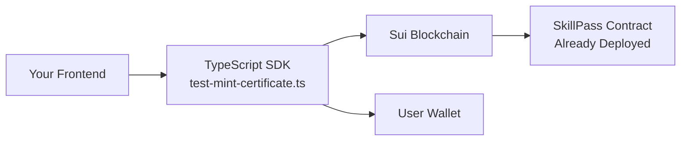

# 🎯 SkillPass Integration Summary

## ✅ Cleanup Complete - Redundant Files Removed

### 🗑️ **Files Removed:**
- ✅ `test-mint-certificate.js` (compiled output)
- ✅ `test-typescript-functions.ts` (temporary test file)  
- ✅ `test-typescript-functions.js` (compiled output)
- ✅ Multiple documentation files (consolidated into DEPLOYMENT_GUIDE.md)
- ✅ Old build artifacts

### 📁 **Final Clean Structure:**
```
skillpass/
├── sources/skillpass.move          # 🔗 Smart contract source
├── tests/skillpass_tests.move      # 🧪 Move tests
├── scripts/                        # 🛠️ Move utility scripts
├── test-certificate-minting.js     # 🧪 JavaScript SDK test
├── test-mint-certificate.ts        # 📦 TypeScript integration (MAIN)
├── mint-certificate-cli.ps1        # 🖥️ CLI tool
├── verify-certificate.ps1          # ✅ Verification tool
├── DEPLOYMENT_GUIDE.md             # 📖 Integration instructions
├── README.md                       # 📋 Complete API docs
└── package.json                    # 📦 Dependencies
```

## 🚀 **No Hosting Required - Frontend Integration Only**

### 🎯 **Integration Type: Direct Blockchain Connection**



### ⚡ **Quick Integration Steps:**

1. **Copy Integration File:**
   ```bash
   # Copy this file to your frontend project:
   test-mint-certificate.ts → skillpass-sdk.ts
   ```

2. **Install Dependencies:**
   ```bash
   npm install @mysten/sui
   ```

3. **Import & Use:**
   ```typescript
   import { createMintCertificateTransaction } from './skillpass-sdk';
   
   // In your React/Vue/Angular component:
   const tx = createMintCertificateTransaction();
   await wallet.signAndExecuteTransaction({ transaction: tx });
   ```

## 🔑 **Key Points:**

### ✅ **What You DON'T Need:**
- ❌ Backend server/API
- ❌ Database hosting  
- ❌ Smart contract deployment (already done)
- ❌ Complex infrastructure

### ✅ **What You DO Need:**
- ✅ Frontend application (React/Vue/Angular/etc.)
- ✅ TypeScript SDK file (`test-mint-certificate.ts`)
- ✅ Sui wallet integration
- ✅ User wallet connection

## 🎯 **Ready for Production:**

- **Smart Contract**: ✅ Deployed on Sui Testnet
- **Package ID**: `0xf1cb82954194f281b4bcddee3b8922b81322cd742d2ab23d169dfaf11883c736`
- **TypeScript SDK**: ✅ Ready for frontend integration
- **Documentation**: ✅ Complete API reference in README.md
- **Testing Tools**: ✅ CLI and JavaScript tests available

## 📱 **Frontend Framework Examples:**

### React/Next.js
```typescript
import { useWallet } from '@mysten/dapp-kit';
import { createMintCertificateTransaction } from './skillpass-sdk';

function CertificateMinter() {
  const { signAndExecuteTransaction } = useWallet();
  
  const mintCertificate = async () => {
    const tx = createMintCertificateTransaction();
    await signAndExecuteTransaction({ transaction: tx });
  };
  
  return <button onClick={mintCertificate}>Mint Certificate</button>;
}
```

### Vue.js
```vue
<script setup>
import { createMintCertificateTransaction } from './skillpass-sdk';

const mintCertificate = async () => {
  const tx = createMintCertificateTransaction();
  await $wallet.signAndExecute(tx);
};
</script>

<template>
  <button @click="mintCertificate">Mint Certificate</button>
</template>
```

## 🎉 **Result: Zero Infrastructure, Maximum Integration**

Your SkillPass smart contract is **ready for immediate frontend integration** with no hosting requirements! Just copy the TypeScript SDK file and start building your dApp. 🚀